# Bud

A aplicação combina API ASP.NET Core, frontend Blazor WebAssembly (SPA)
utilizando PostgreSQL.

## Para quem é este README

Este documento é voltado para devs que precisam:
- entender rapidamente a arquitetura e os padrões do Bud,
- subir o ambiente local,
- executar fluxos principais de desenvolvimento com segurança.

## Índice

- [Arquitetura da aplicação](#arquitetura-da-aplicação)
- [Padrões arquiteturais adotados](#padrões-arquiteturais-adotados)
- [Convenções de nomenclatura](#convenções-de-nomenclatura)
- [Modelo de domínio (DDD)](#modelo-de-domínio-ddd)
- [Como contribuir](#como-contribuir)
- [Como rodar](#como-rodar-com-docker)
- [Como rodar sem Docker](#como-rodar-sem-docker)
- [Servidor MCP (Metas e Indicadores)](#servidor-mcp-metas-e-indicadores)
- [Deploy no Google Cloud](#deploy-no-google-cloud)
- [Onboarding rápido (30 min)](#onboarding-rápido-30-min)
- [Testes](#testes)
- [Observabilidade](#observabilidade)
- [Health checks](#health-checks)
- [Endpoints principais](#endpoints-principais)
- [Sistema de Design e Tokens](#sistema-de-design-e-tokens)

## Arquitetura da aplicação

### Visão geral

O Bud segue uma arquitetura em camadas com separação explícita de responsabilidades:

- **API (`Bud.Api`)**: exposição HTTP, autenticação/autorização, middleware e composição de dependências.
- **Application (`src/Server/Bud.Application`)**: casos de uso, portas de aplicação, mapeamentos, read models e orquestração de eventos de domínio.
  - `Common`: resultados e utilitários transversais.
  - `Mapping`: mapeamento entre read models/domínio e contratos de borda.
- **Domain (`src/Server/Bud.Domain`)**: entidades, aggregate roots, value objects, eventos de domínio, primitivos e interfaces de repositório.
- **Infrastructure (`src/Server/Bud.Infrastructure`)**: EF Core (`ApplicationDbContext`), repositórios, serviços de infraestrutura, migrations e specifications de consulta.
- **Client (`Bud.BlazorWasm`)**: SPA Blazor WASM com consumo da API.
- **Shared (`Bud.Shared`)**: contratos de borda compartilhados entre cliente, servidor e MCP.

### Organização do backend (`src/Server/*`)

- **Controllers** recebem requests, validam payloads (FluentValidation) e delegam para Use Cases.
  Validações dependentes de dados devem passar por abstrações/repositórios, não por acesso direto de validator ao `DbContext`.
- **Use Cases** (`src/Server/Bud.Application/Features/<Feature>/UseCases/`) centralizam o fluxo completo da aplicação (orquestração, autorização, notificações) e retornam `Result`/`Result<T>` (`src/Server/Bud.Application/Common/`). Cada use case é uma classe com método `ExecuteAsync`, injetada diretamente nos controllers.
  Os namespaces explícitos espelham a estrutura física: `Bud.Application.Features.<Feature>.UseCases`.
- **Infrastructure** (`src/Server/Bud.Infrastructure/`) contém implementações concretas:
  - pastas por feature: implementações dos repositórios e adapters concretos associados à capacidade (`Goals/`, `Me/`, `Notifications/`, `Organizations/`, `Sessions/`, etc.).
  - `Authorization/`: adapters transversais de tenant/autorização que não pertencem a uma feature específica.
  - `Querying/`: specifications de consulta para filtros reutilizáveis.
  - `Persistence/`: `ApplicationDbContext`, factory de design-time, configurations, migrations e `DbSeeder`.
- **Authorization e DI da API** vivem em `src/Server/Bud.Api/Authorization/` e `src/Server/Bud.Api/DependencyInjection/`.

### Padrões arquiteturais adotados

- **Use Cases + Repositories (Clean Architecture)**
  Controllers delegam para Use Cases (`Application/Features/<Feature>/UseCases/`), que dependem de interfaces em `Application/Features/<Feature>/` e, quando necessário, de ports transversais em `Application/Ports`.
  Implementações concretas ficam em `Infrastructure/Features/<Feature>/` e em poucos módulos transversais (`Authorization/`, `Persistence/`). `Domain` não depende de `Application` nem de `Infrastructure`.
  Referências: `docs/adr/ADR-0002-arquitetura-ddd-estrita-e-regras-de-dependencia.md`.
- **Policy-based Authorization (Requirement/Handler)**
  Regras de autorização centralizadas em policies e handlers, reduzindo condicionais espalhadas.
  Referências: `docs/adr/ADR-0007-autenticacao-e-autorizacao-por-politicas.md`.
- **Specification Pattern (consultas reutilizáveis)**
  Filtros de domínio encapsulados em specifications para evitar duplicação de predicados.
  Referências: `src/Server/Bud.Infrastructure/Querying/`.
- **Structured Logging (source-generated)**
  Logs com `[LoggerMessage]` definidos localmente por componente (`partial`), com `EventId` estável e sem catálogo central global.
- **Governança arquitetural por testes + ADRs**  
  Decisões versionadas (ADR) e proteção contra regressão de fronteiras via testes de arquitetura.
  Referências: `docs/adr/README.md` e `tests/Server/Bud.ArchitectureTests/Architecture/ArchitectureTests.cs`.
- **Aggregate Roots explícitas**
  Entidades raiz de agregado são marcadas com `IAggregateRoot` para tornar boundaries verificáveis por testes.
  Referências: `docs/adr/ADR-0003-agregados-entidades-value-objects-e-invariantes.md`.
- **Invariantes no domínio (modelo rico)**  
  Regras centrais de negócio são aplicadas por métodos de agregado/entidade (`Create`, `Rename`, `SetScope`, etc.) com tradução para `Result` na camada de aplicação (Use Cases).
  Inclui Value Objects formais (`PersonName`, `GoalScope`, `ConfidenceLevel`, `IndicatorRange`) para reduzir primitive obsession.
- **Notification Orchestration (Application)**
  Orquestração de notificações centralizada em `Application/EventHandlers/` (`NotificationOrchestrator`), desacoplada dos repositórios.
- **Domain Events + Unit of Work**
  Eventos de domínio (`IDomainEvent`, `IHasDomainEvents`) são disparados por agregados e despachados via `IUnitOfWork`/`EfUnitOfWork` no commit. Handlers tipados (`IDomainEventNotifier<T>`) em `Application/EventHandlers/` reagem a eventos como `GoalCreatedDomainEvent`, `GoalUpdatedDomainEvent`, `GoalDeletedDomainEvent` e `CheckinCreatedDomainEvent`.
  Referências: `docs/adr/ADR-0009-eventos-de-dominio-e-notificacoes.md`.

### Convenções de nomenclatura

Nomes são derivados sistematicamente do recurso REST. A tabela abaixo mostra a cadeia completa usando **Goal** como exemplo:

| Camada | Convenção | Exemplo |
|---|---|---|
| Endpoint REST | `api/{recurso-plural}` | `api/goals` |
| Controller | `{RecursoPlural}Controller` | `GoalsController` |
| Método CRUD | `Create`, `Update`, `Delete`, `GetById`, `GetAll` | `GoalsController.Create` |
| Método sub-recurso | `Get{SubRecurso}` | `GoalsController.GetIndicators` |
| Use case (criação) | `Create{Recurso}` | `CreateGoal` |
| Use case (atualização) | `Patch{Recurso}` | `PatchGoal` |
| Use case (exclusão) | `Delete{Recurso}` | `DeleteGoal` |
| Use case (leitura) | `Get{Recurso}ById` | `GetGoalById` |
| Use case (listagem) | `List{RecursoPlural}` | `ListGoals` |
| Use case (sub-recurso) | `List{Pai}{SubRecurso}` | `ListGoalIndicators` |
| Método do use case | Sempre `ExecuteAsync` | `CreateGoal.ExecuteAsync(...)` |
| Diretório do use case | `Application/Features/{Feature}/UseCases/` | `Application/Features/Goals/UseCases/` |
| Namespace do use case | `Bud.Application.Features.{Feature}.UseCases` | `Bud.Application.Features.Goals.UseCases` |
| Request DTO (criação) | `Create{Recurso}Request` | `CreateGoalRequest` |
| Request DTO (atualização) | `Patch{Recurso}Request` | `PatchGoalRequest` |
| Response DTO | `{Recurso}Response` | `GoalResponse` |
| Response DTO especializado | `{Recurso}{Qualificador}Response` | `GoalProgressResponse` |
| Interface de repositório | `I{AgregadoRaiz}Repository` | `IGoalRepository` |
| Implementação de repositório | `{AgregadoRaiz}Repository` | `GoalRepository` |
| Entidade de domínio | Singular, em `Domain/<Feature>/` | `Goal` |

**Discrepâncias intencionais entre camadas:**

- **Controller `Update` vs Use Case `Patch`**: o controller usa `Update` por legibilidade REST; o use case e o DTO usam `Patch` para refletir o verbo HTTP (PATCH = atualização parcial).
- **Controller `GetAll` vs Use Case `List`**: o controller segue a convenção REST (`GET` = "get"); o use case descreve a operação de negócio ("list").
- **Entidade `GoalTask` vs DTO `Task`**: a entidade de domínio é `GoalTask` para evitar conflito com `System.Threading.Tasks.Task`; no controller, DTOs e repositório usa-se `Task` (ex: `TasksController`, `TaskResponse`, `ITaskRepository`).
- **Checkins dentro de `IndicatorsController`**: operações CRUD de checkin ficam no `IndicatorsController` (sub-recurso `/api/indicators/{id}/checkins`), com sufixo `Action` nos métodos (`CreateCheckinAction`, `PatchCheckinAction`, `DeleteCheckinAction`) para evitar colisão de nomes. Os use cases permanecem co-localizados na feature `Indicators`.

#### Rastreabilidade ponta a ponta (exemplo: criar meta)

```
POST /api/goals
  → GoalsController.Create
    → CreateGoal.ExecuteAsync (Application/Features/Goals/UseCases/)
      → IGoalRepository.AddAsync (Application/Features/Goals/)
        → GoalRepository (Infrastructure/Features/Goals/)
    Payload: CreateGoalRequest (Bud.Shared/Contracts/Requests/)
    Retorno: GoalResponse (Bud.Shared/Contracts/Responses/)
```

#### Rastreabilidade ponta a ponta (exemplo: listar indicadores de uma meta)

```
GET /api/goals/{id}/indicators
  → GoalsController.GetIndicators
    → ListGoalIndicators.ExecuteAsync (Application/Features/Goals/UseCases/)
      → IIndicatorRepository.GetByGoalIdAsync (Application/Features/Indicators/)
    Retorno: PagedResult<IndicatorResponse>
```

### Modelo de domínio (DDD)

O Bud usa DDD com aggregate roots explícitos. Entidades de domínio ficam em `Domain/<Feature>/`, interfaces de repositório ficam em `Application/Features/<Feature>/`, value objects em `Domain/ValueObjects/` e eventos de domínio em `Domain/<Feature>/Events/`, com namespaces espelhando essas pastas.

#### Aggregate roots e boundaries

Cada aggregate root é marcado com `IAggregateRoot` e possui um repositório dedicado (`I{AggregateRoot}Repository`). Child entities são gerenciadas exclusivamente pelo repositório do parent — não possuem repositório próprio.

| Aggregate Root | Child Entities | Repositório |
|---|---|---|
| `Goal` | `Indicator`, `GoalTask` (via goal) | `IGoalRepository` |
| `Organization` | `Workspace` (via organization) | `IOrganizationRepository` |
| `Workspace` | `Team` (via workspace) | `IWorkspaceRepository` |
| `Team` | `CollaboratorTeam` (join entity) | `ITeamRepository` |
| `Collaborator` | `CollaboratorTeam`, `CollaboratorAccessLog` | `ICollaboratorRepository` |
| `Indicator` | `Checkin` | `IIndicatorRepository` |
| `Template` | `TemplateGoal`, `TemplateIndicator` | `ITemplateRepository` |
| `Notification` | — | `INotificationRepository` |

**Exceções notáveis:**
- `GoalTask` não é aggregate root (`ITenantEntity` apenas), mas possui repositório próprio (`ITaskRepository`) porque é gerenciado como recurso REST independente (`PATCH /api/tasks/{id}`, `DELETE /api/tasks/{id}`).
- `Checkin` não possui repositório próprio — persistência é via `IIndicatorRepository` (métodos `AddCheckinAsync`, `RemoveCheckinAsync`, etc.), respeitando o boundary do agregado `Indicator`.
- `DashboardReadStore` implementa um Application Port da feature `Me` (`IMyDashboardReadStore`), não uma interface de Domain Repository. Trata-se de um read model, não de um repositório de agregado.

#### Value Objects (`Domain/ValueObjects/`)

| Value Object | Uso |
|---|---|
| `EntityName` | Nomes de entidades organizacionais (validação de tamanho e formato) |
| `PersonName` | Nome de colaborador (first/last name semântico) |
| `EmailAddress` | E-mail validado |
| `IndicatorRange` | Faixa de valores (baseline, target) |
| `ConfidenceLevel` | Nível de confiança em checkins (1–5) |
| `EngagementScore` | Score de engajamento calculado |
| `PerformanceIndicator` | Indicador de performance calculado |
| `NotificationTitle` | Título de notificação (tamanho máximo) |
| `NotificationMessage` | Mensagem de notificação (tamanho máximo) |

#### Diagrama de agregados e boundaries

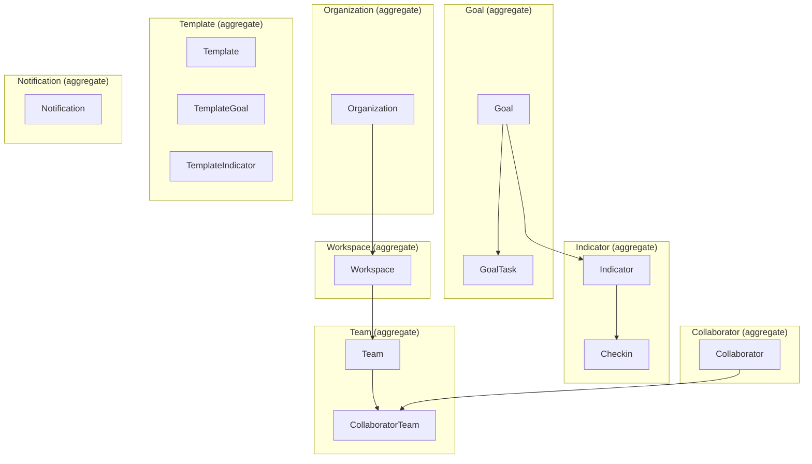

### Multi-tenancy

Isolamento por organização (`OrganizationId`) com:

- `ITenantProvider` para resolver tenant do contexto autenticado.
- Query filters globais do EF Core.
- `TenantRequiredMiddleware` para reforçar seleção/autorização de tenant em `/api/*`.
- Cabeçalho `X-Tenant-Id` enviado pelo client quando uma organização específica está selecionada.

### Fluxo de requisição (resumo)

1. Request chega no controller.
2. Payload é validado.
3. Controller chama o Use Case correspondente.
4. Use Case aplica regras de autorização/orquestração e delega para repositórios/ports (via interfaces em `Application/Features/<Feature>/` e, quando transversal, em `Application/Ports`).
5. Repositório persiste/consulta via `ApplicationDbContext`.
6. Use Case orquestra notificações quando aplicável (via `NotificationOrchestrator`).
7. Resultado (`Result`) é mapeado para resposta HTTP.

### Testes e governança arquitetural

- **Unit tests**: regras de negócio, validações, commands/queries e componentes de infraestrutura.
- **Integration tests**: ciclo HTTP completo com PostgreSQL em container.
- **Architecture tests**: evitam regressão de fronteira entre camadas (ex.: Use Case depender de Infrastructure diretamente), validam tenant isolation, autorização e boundaries de aggregate roots.
  A camada de infraestrutura exige `IEntityTypeConfiguration<T>` dedicada para todas as entidades do `ApplicationDbContext`.
- **ADRs**: decisões arquiteturais versionadas em `docs/adr/`.

### ADRs e fluxo de PR

- Toda mudança arquitetural deve criar/atualizar ADR.
- ADRs seguem convenção `docs/adr/ADR-XXXX-*.md`.
- Índice e convenções: `docs/adr/README.md`.
- No PR, inclua explicitamente:
  - `Architectural impact: yes/no`
  - `ADR: ADR-XXXX` (quando aplicável)

Para lista atualizada de ADRs e ordem recomendada de leitura, consulte:
`docs/adr/README.md`.

### Diagramas

#### Arquitetura e fluxo principal

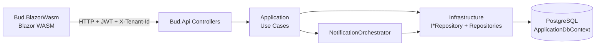

#### Sequência de request com notificações

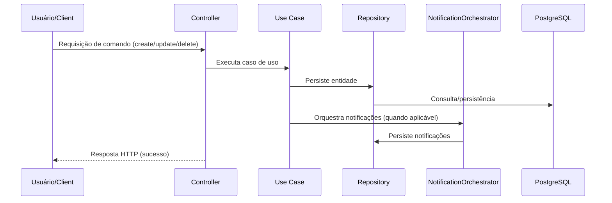

#### Modelo de domínio e hierarquia organizacional

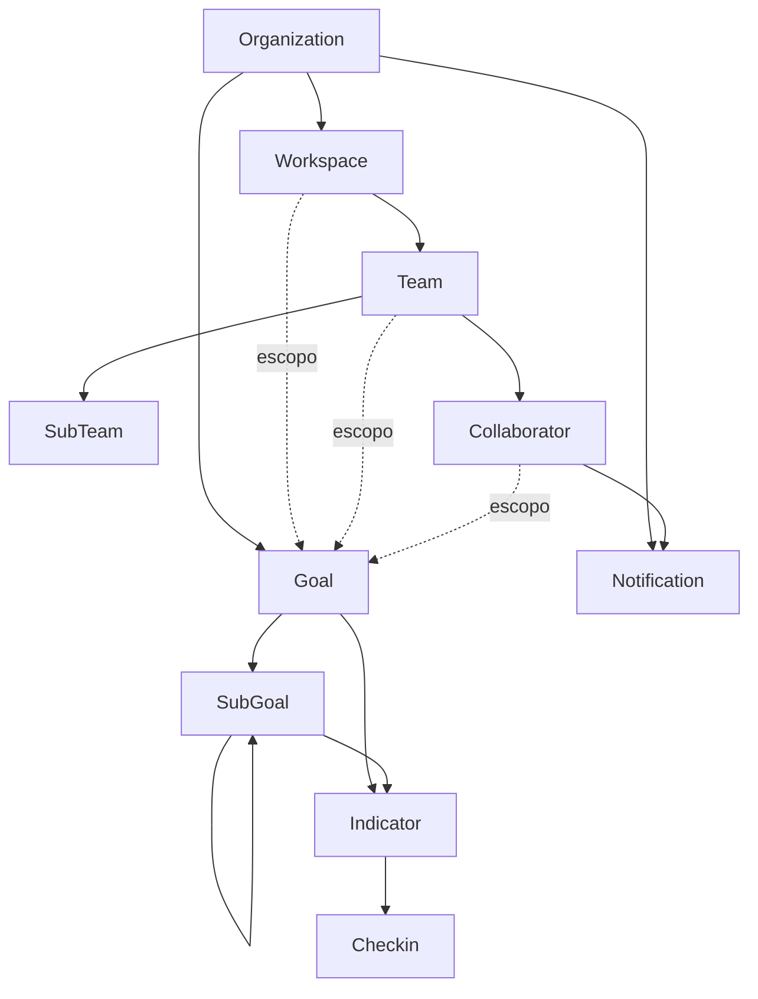

#### Fluxo de autenticação, tenant e autorização

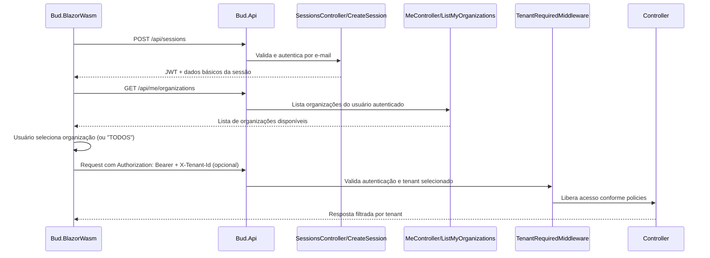

#### Fluxo completo de request (fim a fim)

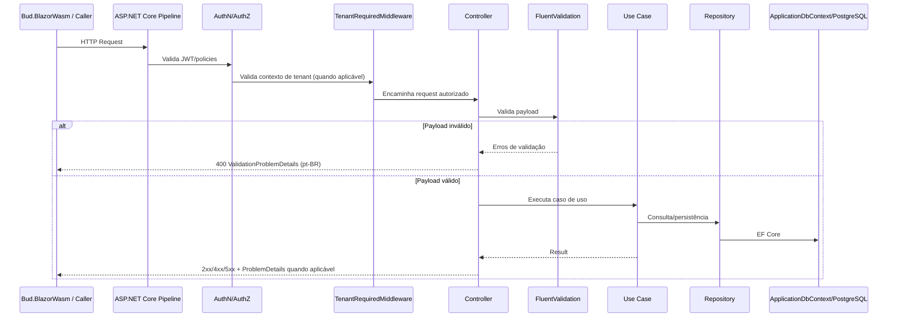

#### Fluxo de request (falhas comuns)

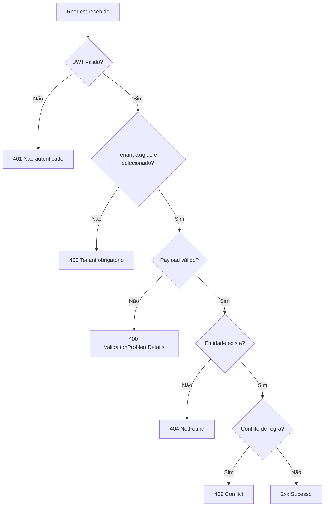

#### Módulos do backend e dependências

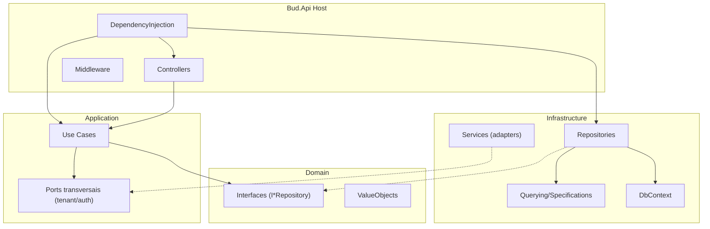

#### Fronteira de responsabilidades (Client x API x Dados)

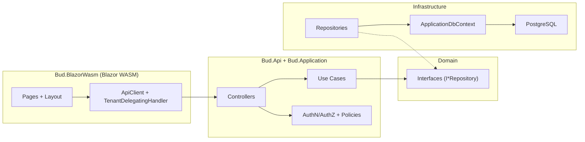

## Como contribuir

Fluxo recomendado de contribuição para manter qualidade arquitetural e consistência:

1. Crie uma branch curta e focada no objetivo da mudança.
2. Escreva/atualize testes antes da implementação (TDD: Red -> Green -> Refactor).
3. Implemente seguindo os padrões do projeto:
   - Controllers -> Use Cases -> Repositories/Ports (via interfaces em `Application/Features/<Feature>/` e, quando transversal, em `Application/Ports`)
   - autorização por policies/handlers
   - mensagens de erro/validação em pt-BR
4. Atualize documentação OpenAPI (summary/description/status/errors) quando alterar contratos.
5. Se houver mudança arquitetural, atualize/crie ADR em `docs/adr/`.
6. Rode a suíte de testes aplicável e valide Swagger/health checks.
7. Abra PR com impacto arquitetural explícito e referência de ADR (quando aplicável).

## Como rodar com Docker

```bash
docker compose up --build
```

- App (UI): `http://localhost:8080`
- MCP: `http://localhost:8081`
- API: `http://localhost:8082`
- Swagger (ambiente Development): `http://localhost:8082/swagger`

### Padrão de desenvolvimento (com hot reload no Docker Compose)

- Os serviços `web`, `api` e `mcp` usam `dotnet watch` no ambiente local via Docker Compose.
- Para Docker Desktop (macOS/Windows), o compose habilita `DOTNET_USE_POLLING_FILE_WATCHER=1` para detecção estável de mudanças em volumes montados.
- O build continua usando caches de NuGet e compilação via volumes nomeados para acelerar o ciclo.

Se você encontrar assets antigos no browser, faça hard refresh. Se persistir, limpe volumes e recompile:

```bash
docker compose down -v
docker compose up --build
```

## Como rodar sem Docker

Pré-requisitos:

- .NET SDK 10
- PostgreSQL 16+

Comandos:

```bash
dotnet restore
dotnet build
dotnet run --project src/Server/Bud.Api
dotnet run --project src/Client/Bud.BlazorWasm
```

## Servidor MCP (Metas e Indicadores)

O repositório inclui um servidor MCP HTTP em `src/Client/Bud.Mcp`, que consome a API do `Bud.Api`.

No transporte HTTP do MCP, o endpoint raiz delega o processamento para `IMcpRequestProcessor`/`McpRequestProcessor`,
mantendo `Program.cs` focado em composição e roteamento.

No ambiente local via Docker Compose:
- Frontend: `http://localhost:8080`
- MCP: `http://localhost:8081`
- API: `http://localhost:8082`

### Configuração (`appsettings` + override por ambiente)

O `Bud.Mcp` lê configuração na seguinte ordem:
1. `appsettings.json`
2. `appsettings.{DOTNET_ENVIRONMENT}.json`
3. variáveis de ambiente (override)

Chaves suportadas:
- `BudMcp:ApiBaseUrl` (ou `BUD_API_BASE_URL`)
- `BudMcp:UserEmail` (ou `BUD_USER_EMAIL`) opcional, para login automático no boot
- `BudMcp:DefaultTenantId` (ou `BUD_DEFAULT_TENANT_ID`)
- `BudMcp:HttpTimeoutSeconds` (ou `BUD_HTTP_TIMEOUT_SECONDS`)
- `BudMcp:SessionIdleTtlMinutes` (ou `BUD_SESSION_IDLE_TTL_MINUTES`)

### Subindo via Docker Compose

```bash
docker compose up --build
```

O serviço `mcp` é criado no compose usando:
- `Dockerfile` (target `dev-mcp-web`)
- `dotnet watch` para recarregar alterações locais automaticamente
- `DOTNET_ENVIRONMENT=Development` (usa `src/Client/Bud.Mcp/appsettings.Development.json`)
- `BUD_API_BASE_URL=http://api:8080` para chamadas internas ao `Bud.Api`
- mapeamento de porta `8081:8080` para evitar conflito com o `web`

Health checks do MCP local:

```bash
curl -i http://localhost:8081/health/live
curl -i http://localhost:8081/health/ready
```

Exemplo de `initialize` no endpoint MCP:

```bash
curl -s http://localhost:8081/ \
  -H "Content-Type: application/json" \
  -d '{"jsonrpc":"2.0","id":1,"method":"initialize"}'
```

A resposta inclui o header `MCP-Session-Id`, que deve ser enviado nas chamadas seguintes (`tools/list`, `tools/call`, etc.).

Fluxo obrigatório para atualizar catálogo MCP:

```bash
dotnet run --project src/Client/Bud.Mcp/Bud.Mcp.csproj -- generate-tool-catalog
dotnet run --project src/Client/Bud.Mcp/Bud.Mcp.csproj -- check-tool-catalog --fail-on-diff
```

Regras importantes do catálogo:
- As ferramentas de domínio (`goal_*`, `goal_indicator_*`, `indicator_checkin_*`) são carregadas exclusivamente do arquivo `src/Client/Bud.Mcp/Tools/Generated/mcp-tool-catalog.json`.
- O `Bud.Mcp` falha na inicialização se o catálogo estiver ausente, inválido, vazio ou sem ferramentas de domínio obrigatórias.
- O comando `check-tool-catalog --fail-on-diff` também valida o contrato mínimo de campos `required` por ferramenta e retorna erro quando houver quebra de contrato.

Se estiver rodando local com `DOTNET_ENVIRONMENT=Development`, defina:
`BUD_API_BASE_URL=http://localhost:8082`.

### Ferramentas MCP disponíveis

- `auth_login`
- `auth_whoami`
- `tenant_list_available`
- `tenant_set_current`
- `session_bootstrap`
- `help_list_actions`
- `help_action_schema`
- `goal_create`, `goal_get`, `goal_list`, `goal_update`, `goal_delete`
- `goal_indicator_create`, `goal_indicator_get`, `goal_indicator_list`, `goal_indicator_update`, `goal_indicator_delete`
- `indicator_checkin_create`, `indicator_checkin_get`, `indicator_checkin_list`, `indicator_checkin_update`, `indicator_checkin_delete`

### Descoberta de parâmetros e bootstrap de sessão no MCP

- `prompts/list` é suportado para compatibilidade de clientes MCP e retorna lista vazia quando não há prompts publicados.
- `auth_login` retorna `whoami`, `requiresTenantForDomainTools` e `nextSteps` para orientar o agente nos próximos passos.
- `session_bootstrap` retorna snapshot de sessão (`whoami`, `availableTenants`, tenant atual) e `starterSchemas` para fluxos de criação.
- `help_action_schema` retorna `required`, `inputSchema` e `example` para uma ação específica (ou todas as ações, quando `action` não é informado).
- Em erro de validação da API, o MCP retorna `statusCode`, `title`, `detail` e `errors` por campo quando disponível.

## Deploy no Google Cloud

Scripts disponíveis:

- `scripts/gcp-bootstrap.sh`: prepara infraestrutura base (APIs, Artifact Registry, Cloud SQL, service account, secrets, permissões do Cloud Build).
- `scripts/gcp-deploy-api.sh`: deploy do `Bud.Api` (com migração EF Core via Cloud Run Job).
- `scripts/gcp-deploy-web.sh`: deploy do `bud-web` (Blazor WASM).
- `scripts/gcp-deploy-mcp.sh`: deploy do `Bud.Mcp` HTTP.
- `scripts/gcp-deploy-all.sh`: executa deploy completo (`Bud.Api` + `Bud.Mcp` + `bud-web`).

Observação: os scripts de deploy remoto usam **Cloud Build** para gerar imagens no GCP (não dependem de `docker build` local).

Pré-requisitos (primeira vez): projeto GCP criado, billing vinculado, usuário com role Owner. Ver `DEPLOY.md` para detalhes.

Fluxo recomendado:

```bash
cp .env.example .env.gcp   # ajustar PROJECT_ID
./scripts/gcp-bootstrap.sh
./scripts/gcp-deploy-all.sh
```

Deploy sem migração (quando o schema não mudou):

```bash
./scripts/gcp-deploy-all.sh --skip-migration
```

Deploy por serviço:

```bash
./scripts/gcp-deploy-api.sh
./scripts/gcp-deploy-api.sh --skip-migration
./scripts/gcp-deploy-web.sh
./scripts/gcp-deploy-mcp.sh
```

Para detalhes operacionais, pré-requisitos e troubleshooting, consulte `DEPLOY.md`.

## Onboarding rápido (30 min)

Objetivo: validar ponta a ponta (auth, tenant, CRUD básico e leitura) em ambiente local.

### 1) Subir a aplicação

Opção A (recomendada):

```bash
docker compose up --build
```

Opção B (sem Docker):

```bash
dotnet restore
dotnet build
dotnet run --project src/Server/Bud.Api
dotnet run --project src/Client/Bud.BlazorWasm
```

Defina a URL base conforme o modo de execução:

```bash
# Com Docker Compose
export BUD_BASE_URL="http://localhost:8080"

# Sem Docker
export BUD_BASE_URL="http://localhost:8080"
```

### 2) Login e captura do token

```bash
curl -s -X POST "$BUD_BASE_URL/api/sessions" \
  -H "Content-Type: application/json" \
  -d '{"email":"admin@getbud.co"}'
```

Copie o `token` da resposta e exporte:

```bash
export BUD_TOKEN="<jwt>"
```

### 3) Descobrir organizações disponíveis

```bash
curl -s "$BUD_BASE_URL/api/me/organizations" \
  -H "Authorization: Bearer $BUD_TOKEN"
```

Copie um `id` e exporte:

```bash
export BUD_ORG_ID="<organization-id>"
```

### 4) Smoke test de leitura tenant-scoped

```bash
curl -s "$BUD_BASE_URL/api/goals?page=1&pageSize=10" \
  -H "Authorization: Bearer $BUD_TOKEN" \
  -H "X-Tenant-Id: $BUD_ORG_ID"
```

### 5) Smoke test de criação de meta

```bash
curl -s -X POST "$BUD_BASE_URL/api/goals" \
  -H "Authorization: Bearer $BUD_TOKEN" \
  -H "X-Tenant-Id: $BUD_ORG_ID" \
  -H "Content-Type: application/json" \
  -d '{
    "name":"Onboarding - Meta",
    "description":"Validação ponta a ponta",
    "startDate":"2026-01-01T00:00:00Z",
    "endDate":"2026-12-31T23:59:59Z",
    "status":"Planned"
  }'
```

### 6) Diagrama rápido do onboarding HTTP

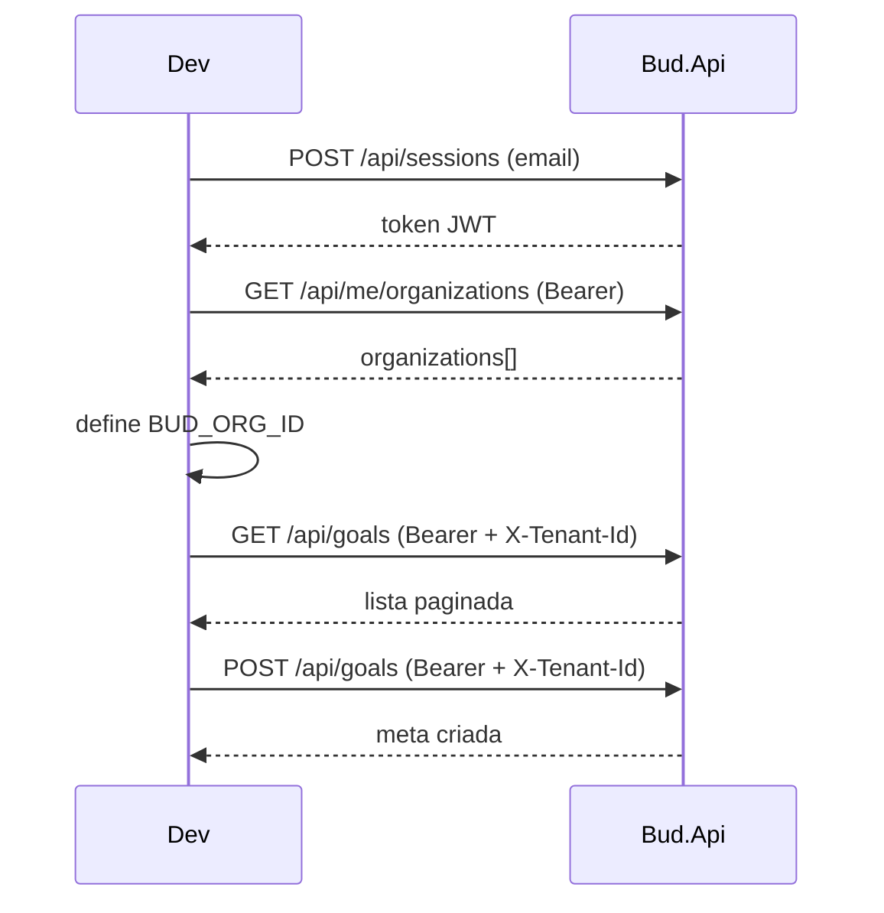

### 7) Debug rápido no backend

- Acesse `http://localhost:8082/swagger` para executar os mesmos fluxos pela UI.
- No Docker Compose, use `http://localhost:8082/swagger`.
- Consulte `GET /health/ready` para validar PostgreSQL.
- Em caso de erro 403, valide se o header `X-Tenant-Id` foi enviado (exceto cenário global admin em "TODOS").

### 8) Troubleshooting rápido (dev local)

- **Porta 8080 ocupada**  
  Sintoma: erro ao subir `docker compose up --build` com bind em `8080`.  
  Ação: pare o processo/serviço que está usando a porta ou altere o mapeamento no `docker-compose.yml`.

- **Falha de conexão com PostgreSQL**  
  Sintoma: `/health/ready` retorna unhealthy para banco.  
  Ação: confirme se o container `db` subiu e se a connection string está correta (`ConnectionStrings:DefaultConnection`).

- **401/403 em endpoints protegidos**  
  Sintoma: chamadas autenticadas falham mesmo após login.  
  Ação: verifique `Authorization: Bearer <token>` e, para endpoints tenant-scoped, envie `X-Tenant-Id`.

- **Dados/artefatos antigos no browser**  
  Sintoma: UI não reflete mudanças recentes.  
  Ação: faça hard reload no navegador. Se persistir, execute `docker compose down -v && docker compose up --build`.

#### Fluxo de diagnóstico rápido (401/403)

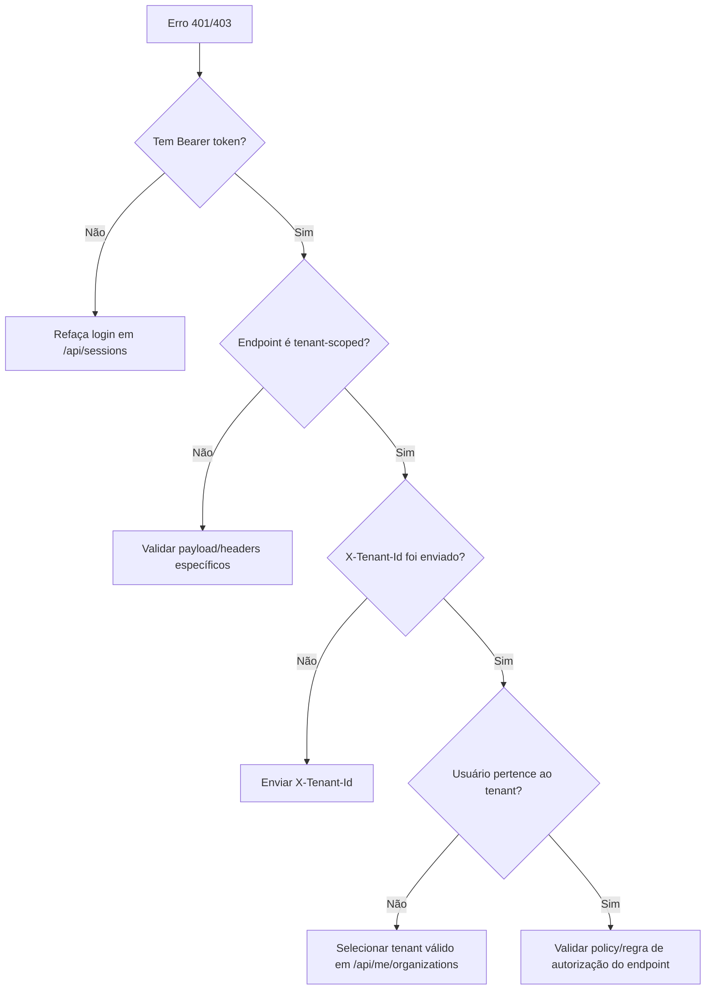

## Testes

```bash
# suíte completa
dotnet test

# testes MCP
dotnet test tests/Client/Bud.Mcp.Tests

# apenas unitários
dotnet test tests/Server/Bud.Api.UnitTests
dotnet test tests/Server/Bud.Application.UnitTests
dotnet test tests/Server/Bud.Domain.UnitTests
dotnet test tests/Server/Bud.Infrastructure.UnitTests
dotnet test tests/Server/Bud.ArchitectureTests

# apenas integração
dotnet test tests/Server/Bud.Api.IntegrationTests
```

Observação:

- `dotnet test Bud.sln` executa também `tests/Client/Bud.Mcp.Tests`.
- Testes de integração usam PostgreSQL via Testcontainers.
- Use `dotnet test --nologo` para saída mais limpa no terminal.
- A solução usa `TreatWarningsAsErrors=true`; avisos quebram build/test.

## Documentação da API (OpenAPI/Swagger)

- UI interativa (Development): `http://localhost:8082/swagger`
- Documento OpenAPI bruto: `http://localhost:8082/openapi/v1.json`
- A documentação é enriquecida com:
  - `ProducesResponseType` por endpoint
  - comentários XML (`summary`, `response`, `remarks`)
  - metadados de conteúdo (`Consumes`/`Produces`) quando aplicável
- Para campos enum em payload JSON, a API aceita tanto `string` (case-insensitive) quanto `number` (compatibilidade retroativa).

## Sistema de Design e Tokens

O Bud 2.0 usa um sistema de tokens de design baseado no [Figma Style Guide](https://www.figma.com/design/j3n8YHBusCH8KEHvheGeF8/-ASSETS--Style-Guide).

### Cores de marca

- **Primária**: Orange (#FF6B35) - CTAs, estados ativos e ações principais
- **Secundária**: Wine (#E838A3) - acentos, destaques e ações secundárias

### Tipografia

- **Crimson Pro**: fonte serifada para títulos e destaques
- **Plus Jakarta Sans**: fonte sem serifa para texto e componentes de interface

### Tokens de design

Todos os valores de design (cores, tipografia, espaçamento e sombras) são definidos como propriedades CSS em [`src/Client/Bud.BlazorWasm/wwwroot/css/tokens.css`](src/Client/Bud.BlazorWasm/wwwroot/css/tokens.css).

### Runtime do design system

- `src/Client/Bud.BlazorWasm/wwwroot/css/fonts.css`: carrega `Crimson Pro` e `Plus Jakarta Sans` de forma local/self-hosted.
- `src/Client/Bud.BlazorWasm/wwwroot/css/design-system.css`: aplica shell global, superfícies, tabelas, autenticação e overrides visuais do design system.
- `src/Client/Bud.BlazorWasm/wwwroot/index.html`: carrega `fonts.css`, `tokens.css`, `app.css` e `design-system.css` nessa ordem.
- O frontend não depende mais do CSS do Bootstrap para a camada visual principal.

**Exemplo de uso:**
```css
.button {
    background: var(--color-brand-primary);
    padding: var(--spacing-3) var(--spacing-4);
    border-radius: var(--radius-md);
    font-size: var(--font-size-base);
}
```

### Atualização de tokens

Veja [DESIGN_TOKENS.md](DESIGN_TOKENS.md) para:
- Referência completa de tokens
- Processo de atualização a partir do Figma
- Convenções de nomenclatura
- Boas práticas

## Banco de Dados

- **Development**: o schema é criado automaticamente via `EnsureCreated()` no startup. Para recriar após mudanças no modelo:
  ```bash
  docker compose down -v && docker compose up --build
  ```
- **Production**: usa EF Core migrations (`dotnet-ef migrations bundle`) via target `prod-migrate` no `Dockerfile.Production`. Migrations ficam em `Infrastructure/Persistence/Migrations/`.

## Observabilidade

O Bud usa OpenTelemetry (traces + métricas) e structured logging compatível com o Cloud Logging do GCP.

### Structured Logging

Em produção (`ASPNETCORE_ENVIRONMENT=Production`), os logs são emitidos em JSON single-line compatível com Cloud Logging:

- Campos: `severity`, `message`, `time`, `logging.googleapis.com/trace`, `logging.googleapis.com/spanId`, `eventId`, `category`, `exception`.
- `severity` é mapeado de `LogLevel` (ex.: `Information` → `INFO`, `Error` → `ERROR`).
- Em desenvolvimento, mantém o formatter padrão do console.
- `GCP_PROJECT_ID` configura o formato completo do trace: `projects/{id}/traces/{traceId}`.

### Distributed Tracing e Métricas (OpenTelemetry)

A instrumentação OTel cobre ASP.NET Core, HttpClient e EF Core. Toda configuração de exportação é via variáveis de ambiente padrão do OTel spec — sem hardcode no código:

| Variável | Descrição | Exemplo (produção) |
|----------|-----------|-------------------|
| `OTEL_SERVICE_NAME` | Nome do serviço | `Bud.Api` ou `Bud.Mcp` |
| `OTEL_RESOURCE_ATTRIBUTES` | Atributos de recurso | `cloud.provider=gcp,cloud.platform=gcp_cloud_run` |
| `OTEL_EXPORTER_OTLP_ENDPOINT` | Endpoint OTLP | `https://telemetry.googleapis.com` |
| `OTEL_EXPORTER_OTLP_PROTOCOL` | Protocolo | `grpc` |

Em dev local sem `OTEL_EXPORTER_OTLP_ENDPOINT`, o exporter tenta `localhost:4317` e falha silenciosamente.

### Log Enrichment e Correlation ID

- `LogEnrichmentMiddleware` (Bud.Api): injeta `TraceId`, `SpanId` e `CorrelationId` no scope de todos os logs da request.
- `McpRequestLoggingMiddleware` (Bud.Mcp): registra cada request com método, path, status code, elapsed e correlation ID.
- Header `X-Correlation-Id` adicionado a todas as respostas.

### EventIds de Log

Ranges estáveis de EventId por domínio:

| Range | Domínio |
|-------|---------|
| 3100–3199 | RequestTelemetryMiddleware |
| 4000–4009 | Goal |
| 4010–4019 | Organization |
| 4020–4029 | Workspace |
| 4030–4039 | Team |
| 4040–4049 | Collaborator |
| 4050–4059 | Indicator |
| 4060–4069 | Checkin |
| 4070–4079 | Template |
| 4080–4089 | GoalTask |
| 4090–4099 | Session / Notification |
| 5000–5009 | McpRequestLoggingMiddleware (Bud.Mcp) |

Referência: `docs/adr/ADR-0013-estrategia-de-observabilidade.md`.

## Health checks

- `GET /health/live`: liveness (sempre saudável).
- `GET /health/ready`: readiness (PostgreSQL).

## Endpoints principais

Referência completa com exemplos interativos disponível em `/swagger` (ambiente Development).

### Sessions (autenticação)

- `POST /api/sessions` — login por e-mail, retorna JWT
- `DELETE /api/sessions/current` — logout

### Me (dados do usuário autenticado)

- `GET /api/me/organizations` — organizações disponíveis
- `GET /api/me/dashboard` — dashboard do colaborador autenticado

### Organizations (CRUD + relacionamentos)

- `POST /api/organizations`
- `GET /api/organizations` — listagem paginada (`?search=&page=1&pageSize=10`)
- `GET /api/organizations/{id}`
- `PATCH /api/organizations/{id}`
- `DELETE /api/organizations/{id}`
- `GET /api/organizations/{id}/workspaces`
- `GET /api/organizations/{id}/collaborators`

### Workspaces (CRUD + relacionamentos)

- `POST /api/workspaces`
- `GET /api/workspaces` — listagem paginada (`?organizationId=&search=&page=1&pageSize=10`)
- `GET /api/workspaces/{id}`
- `PATCH /api/workspaces/{id}`
- `DELETE /api/workspaces/{id}`
- `GET /api/workspaces/{id}/teams`

### Teams (CRUD + relacionamentos)

- `POST /api/teams`
- `GET /api/teams` — listagem paginada (`?workspaceId=&parentTeamId=&search=&page=1&pageSize=10`)
- `GET /api/teams/{id}`
- `PATCH /api/teams/{id}`
- `DELETE /api/teams/{id}`
- `GET /api/teams/{id}/subteams`
- `GET /api/teams/{id}/collaborators`
- `GET /api/teams/{id}/collaborators/lookup`
- `PATCH /api/teams/{id}/collaborators`
- `GET /api/teams/{id}/collaborators/eligible-for-assignment`

### Collaborators (CRUD + relacionamentos)

- `POST /api/collaborators`
- `GET /api/collaborators` — listagem paginada (`?teamId=&search=&page=1&pageSize=10`)
- `GET /api/collaborators/{id}`
- `PATCH /api/collaborators/{id}`
- `DELETE /api/collaborators/{id}`
- `GET /api/collaborators/lookup`
- `GET /api/collaborators/leaders`
- `GET /api/collaborators/{id}/subordinates`
- `GET /api/collaborators/{id}/teams`
- `PATCH /api/collaborators/{id}/teams`
- `GET /api/collaborators/{id}/teams/eligible-for-assignment`

### Goals (CRUD + consultas)

- `POST /api/goals`
- `GET /api/goals` — listagem paginada (filtro por `filter`, `parentId`)
- `GET /api/goals/{id}`
- `PATCH /api/goals/{id}`
- `DELETE /api/goals/{id}`
- `GET /api/goals/progress`
- `GET /api/goals/{id}/children` — sub-metas (árvore recursiva via `parentId`)
- `GET /api/goals/{id}/indicators` — indicadores da meta
- `GET /api/goals/{id}/tasks` — tarefas da meta
- Campo opcional nos payloads de criação/atualização: `dimension` (texto livre) e `parentId` (para sub-metas).

### GoalTasks (CRUD)

- `POST /api/goals/{goalId}/tasks` — cria tarefa para a meta
- `GET /api/goals/{id}/tasks` — lista tarefas (paginada)
- `PATCH /api/tasks/{id}` — atualiza nome, descrição ou estado da tarefa
- `DELETE /api/tasks/{id}` — remove tarefa
- Estados possíveis: `ToDo`, `Doing`, `Done`, `Archived`.

### Indicators (CRUD + progress)

- `POST /api/indicators`
- `GET /api/indicators` — listagem paginada (filtro por `goalId`)
- `GET /api/indicators/{id}`
- `PATCH /api/indicators/{id}`
- `DELETE /api/indicators/{id}`
- `GET /api/indicators/{id}/progress`
- `POST /api/indicators/{id}/checkins` — cria checkin
- `GET /api/indicators/{id}/checkins` — lista checkins do indicador
- `GET /api/indicators/{id}/checkins/{checkinId}` — detalhe do checkin
- `PATCH /api/indicators/{id}/checkins/{checkinId}` — atualiza checkin
- `DELETE /api/indicators/{id}/checkins/{checkinId}` — remove checkin

### Templates (CRUD)

- `POST /api/templates`
- `GET /api/templates` — listagem paginada
- `GET /api/templates/{id}`
- `PATCH /api/templates/{id}`
- `DELETE /api/templates/{id}`
- Modelos padrão semeados para a organização bootstrap (`getbud.co`): `BSC`, `Mapa Estratégico`, `Planejamento Estratégico Anual`, `OKR` e `PDI`.
- Payloads de criação/atualização aceitam `blueprintJson` (jsonb) com a estrutura de metas e indicadores do template.

### Notifications

- `GET /api/notifications` — listagem paginada (filtro por `isRead`)
- `PATCH /api/notifications/{id}` — marca como lida
- `PATCH /api/notifications` — marca todas como lidas

### Exemplos de payloads de criação

**Organization:**
```json
{
  "name": "acme.com.br",
  "ownerId": "00000000-0000-0000-0000-000000000000"
}
```

**Workspace:**
```json
{
  "name": "Produto",
  "organizationId": "00000000-0000-0000-0000-000000000000"
}
```

**Team:**
```json
{
  "name": "Time A",
  "workspaceId": "00000000-0000-0000-0000-000000000000",
  "parentTeamId": null
}
```

**Collaborator:**
```json
{
  "fullName": "Maria Silva",
  "email": "maria@acme.com",
  "teamId": "00000000-0000-0000-0000-000000000000",
  "leaderId": null
}
```

**Goal (Meta):**
```json
{
  "name": "Aumentar NPS",
  "description": "Melhorar satisfação do cliente",
  "startDate": "2026-01-01T00:00:00Z",
  "endDate": "2026-03-31T23:59:59Z",
  "status": "Planned",
  "parentId": null
}
```

**Checkin** (`POST /api/indicators/{id}/checkins`)**:**
```json
{
  "value": 42.5,
  "text": null,
  "checkinDate": "2026-02-07T00:00:00Z",
  "note": "Evolução semanal",
  "confidenceLevel": 4
}
```
